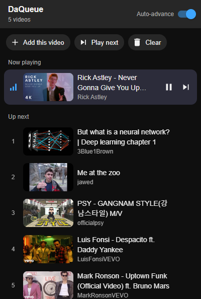
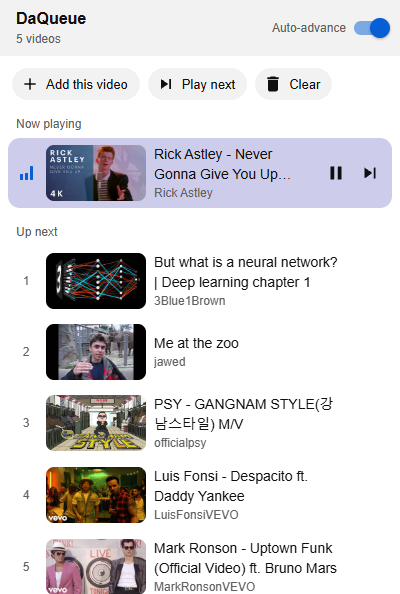

# DaQueue

A persistent, reorderable video queue for YouTube, as a Chrome extension.

YouTube's built-in queue disappears when you close the tab and only lives in the miniplayer. DaQueue gives you a real queue. It survives browser restarts, sits beside the video you're watching, and plays the next video when the current one ends.


## Screenshots

| Queue panel (dark) | Queue panel (light) |
|---|---|
|  |  |

| Toolbar popup (dark) | Toolbar popup (light) |
|---|---|
|  |  |

**Add to queue** and **Play next** on any thumbnail. Labels slide out on hover:


## Features

- **Add from anywhere on YouTube.** Hover a thumbnail and click **Add to queue** or **Play next**. You can also use the right-click menu on any video link, or YouTube's own "Add to queue" option, which DaQueue takes over.
- **Queue panel on the watch page.** A collapsible panel sits above the recommendations and follows YouTube's style and light/dark theme. It shows what's playing now and what's up next.
- **Toolbar popup.** Click the extension icon to see and manage the queue from any tab. It includes play/pause and next controls for the video playing in the active YouTube tab.
- **Drag to reorder.** Cards slide out of the way as you drag, and the numbers update live so you always know where a video will land.
- **Auto-advance.** When a video ends, including when you skip to the end, the next queued video starts. Turn it off with the toggle.
- **Takes over YouTube's "next".** While your queue has videos, the player's ⏭ button, `Shift+N` and your keyboard's media keys play the next queued video instead of YouTube's recommendation. With an empty queue, YouTube behaves normally.
- **Persistent.** The queue is saved locally and survives restarts until you play, remove or clear the videos.
- **Incognito aware.** If you allow the extension in incognito, incognito windows get their own separate queue. It's kept in memory only and discarded when the last incognito window closes.
- **Thumbnail-tinted highlights.** Hovering a queued video highlights it in that thumbnail's dominant colour, like YouTube does.

## Installation

DaQueue isn't on the Chrome Web Store yet. Install it from source:

1. Download this repository, either with **Code → Download ZIP** and unzip it, or by cloning it:
   ```sh
   git clone https://github.com/abhiramkunnath/DaQueue.git
   ```
2. Open `chrome://extensions` in Chrome.
3. Turn on **Developer mode** (top-right corner).
4. Click **Load unpacked** and select the `DaQueue` folder, the one that contains `manifest.json`.
5. Reload any YouTube tabs you already had open.

To update, pull or download the new version, click the reload icon on DaQueue's card in `chrome://extensions`, then reload your YouTube tabs.

Requires Chrome 111 or newer. Other Chromium browsers, such as Edge and Brave, should work but haven't been tested.

## Usage

| To… | Do this |
|---|---|
| Add a video to the end of the queue | Hover its thumbnail → **Add to queue**, or right-click the link → **Add to DaQueue** |
| Make a video play next | Hover its thumbnail → **Play next**, or right-click the link → **Play next in DaQueue**. If it's already queued, it moves to the front. |
| Add the video you're watching | **Add this video** in the panel or the popup |
| Play a specific queued video | Click it in the panel or popup |
| Skip to the next queued video | **Play next** button, the player's ⏭, `Shift+N`, your media "next" key, or `Alt+Shift+N` from any tab |
| Reorder | Drag a card up or down. Press `Esc` to cancel a drag. |
| Remove a video | Hover it → ✕ |
| Clear everything | **Clear**, then **Clear all?** to confirm |

A video is removed from the queue once it starts playing from the queue.

### Keyboard shortcuts

| Shortcut | Where | Action |
|---|---|---|
| `Shift+N` | YouTube watch page | Play the next queued video (replaces YouTube's "next") |
| `Alt+Shift+N` | Anywhere in Chrome | Play the next queued video in the current YouTube tab, or in a new tab |
| Media "next" key | While YouTube is playing | Play the next queued video |

You can change `Alt+Shift+N` at `chrome://extensions/shortcuts`.

## Permissions

| Permission | Why it's needed |
|---|---|
| `storage` | Save your queue and settings on your computer |
| `contextMenus` | The right-click **Add to DaQueue** and **Play next in DaQueue** entries |
| `www.youtube.com` | Add the panel and buttons to YouTube pages, and look up video titles with YouTube's public oEmbed endpoint |
| `i.ytimg.com` | Read thumbnail colours for the tinted highlights |

## Privacy

DaQueue has no servers, analytics or tracking, and it doesn't use sync.

- **Where your data lives:** your queue stays in your browser's local extension storage. Incognito queues are kept in memory only.
- **Network requests:** the extension only contacts YouTube itself, to fetch video titles (`youtube.com/oembed`) and thumbnails (`i.ytimg.com`). These requests are sent without cookies.

## How it works

```
background.js        Service worker. It owns every queue change, applied one at a time so they
                     can't collide, plus the toolbar badge, context menu, keyboard shortcut and
                     thumbnail colour extraction.
ui/queue-view.js     The shared queue UI (list, drag-to-reorder, now playing), used by both the
ui/queue-view.css    in-page panel and the popup.
content/content.js   The YouTube-specific parts: thumbnail buttons, mounting the panel,
content/content.css  auto-advance, taking over the ⏭ button and Shift+N, and answering the popup.
content/bridge.js    Runs in the page's own JavaScript context, which it needs to trigger
                     YouTube's in-page navigation, handle media keys, detect when a video ends,
                     and redirect YouTube's native "Add to queue".
popup/               The toolbar popup.
```

The queue is a plain array in `chrome.storage`. Every open YouTube tab and the popup listen for storage changes, so they all stay in sync. The UI is built with DOM methods, never `innerHTML`, because YouTube enforces Trusted Types.

## Known limitations

- **YouTube changes its markup often.** If buttons or the panel stop appearing, the selectors probably need updating. They're all in the `SEL` object at the top of `content/content.js`, plus a few in `content/bridge.js`.
- **Desktop site only.** `m.youtube.com` and YouTube Music aren't supported.
- **Next-button preview.** Hovering the player's ⏭ still shows YouTube's own suggestion, even though clicking it plays your queue.
- **Playlists.** When you're watching a playlist and your queue isn't empty, the queue takes priority over the playlist's next video.
- **Thumbnail buttons and inline previews.** If YouTube's inline preview starts playing over a thumbnail, it can cover the DaQueue buttons. Use the right-click menu or YouTube's own "Add to queue" instead.

## Troubleshooting

- **"DaQueue was updated — reload this tab":** the extension was reloaded or updated while the tab was open. Reload the tab.
- **Buttons or panel missing after install:** reload the YouTube tab. Content scripts only load into pages opened after installation.
- **Incognito shows nothing:** enable **Allow in Incognito** on DaQueue's details page in `chrome://extensions`.

## Contributing

Issues and pull requests are welcome. There's no build step, so edit the files and reload the extension to test. When reporting a bug, include your Chrome version and the page where it happened. YouTube sometimes tests different layouts on different accounts.

## License

[MIT](LICENSE) © Abhiram K ([@abhiramkunnath](https://github.com/abhiramkunnath))
